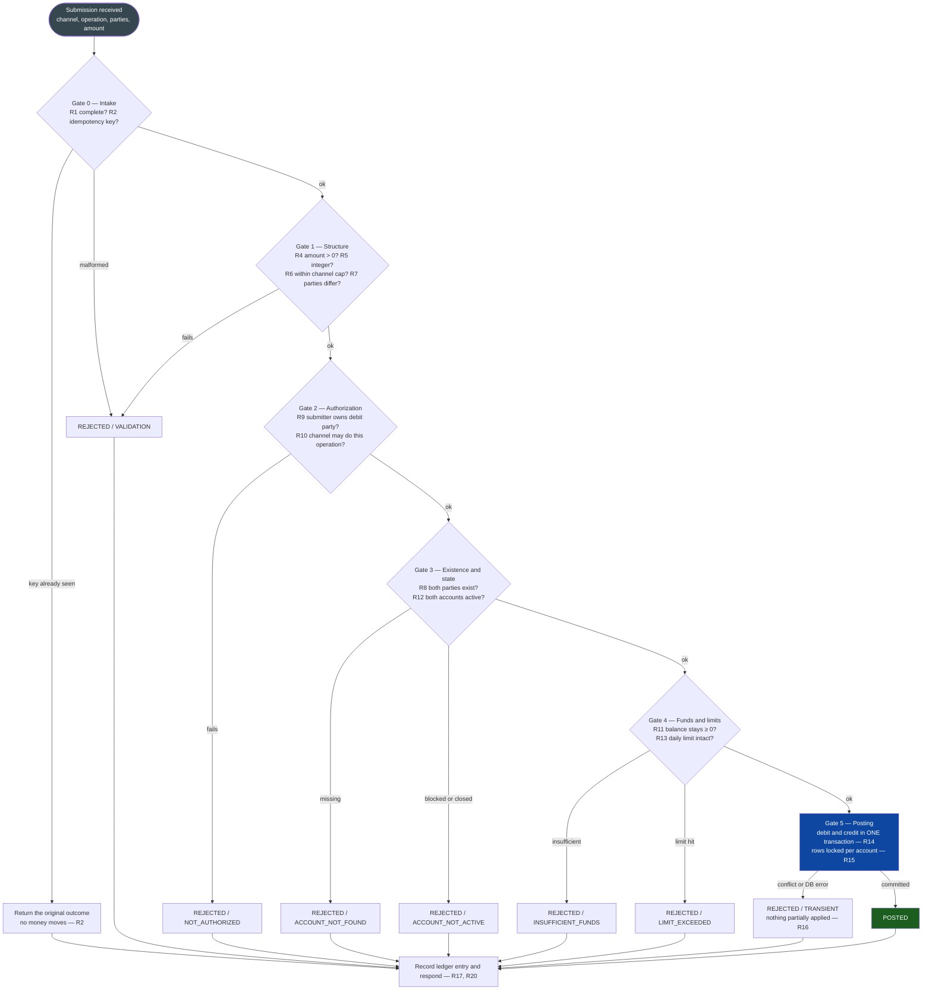
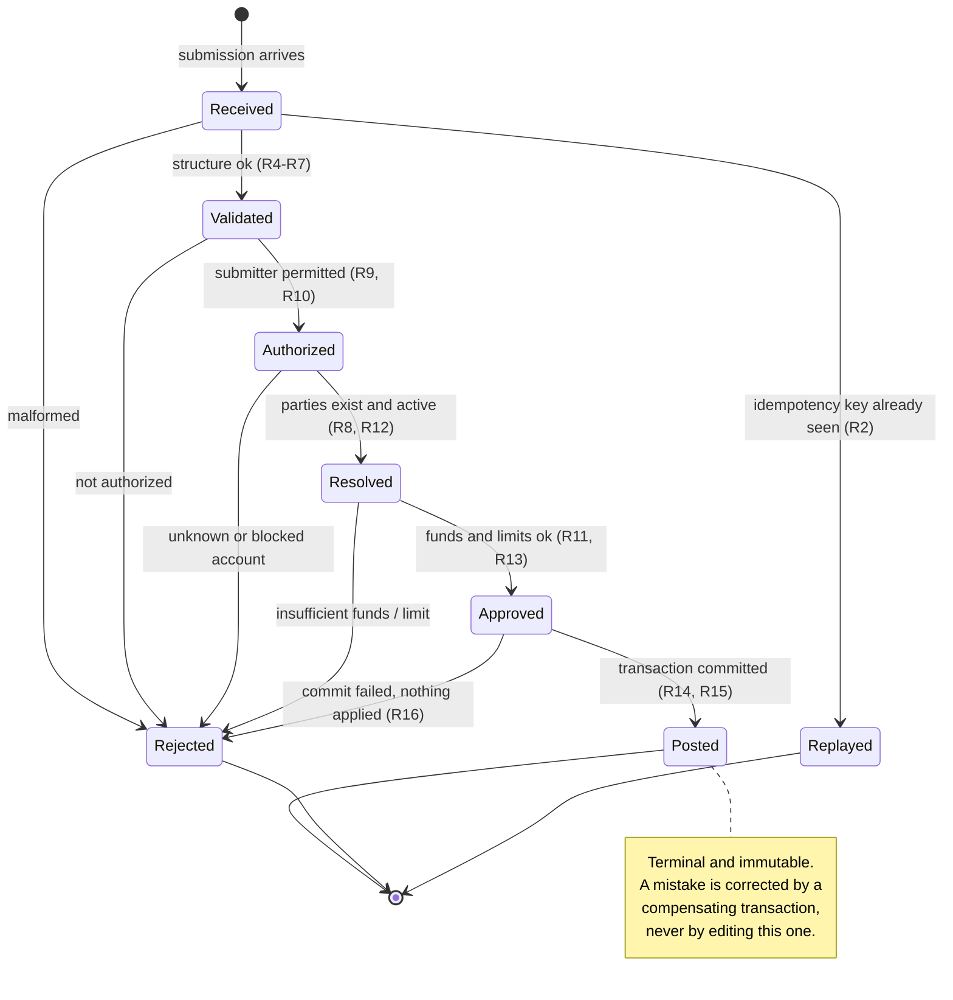
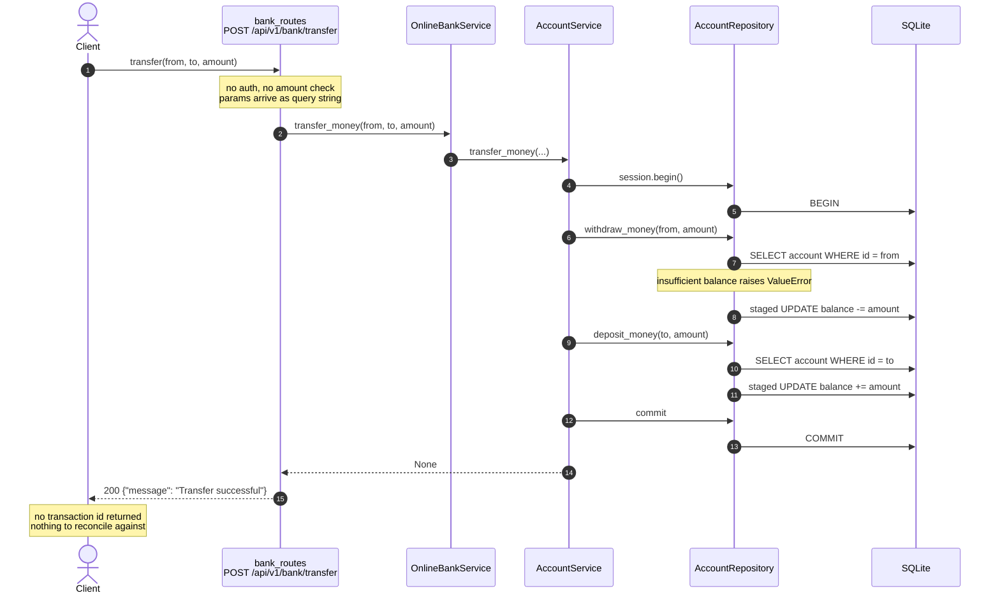
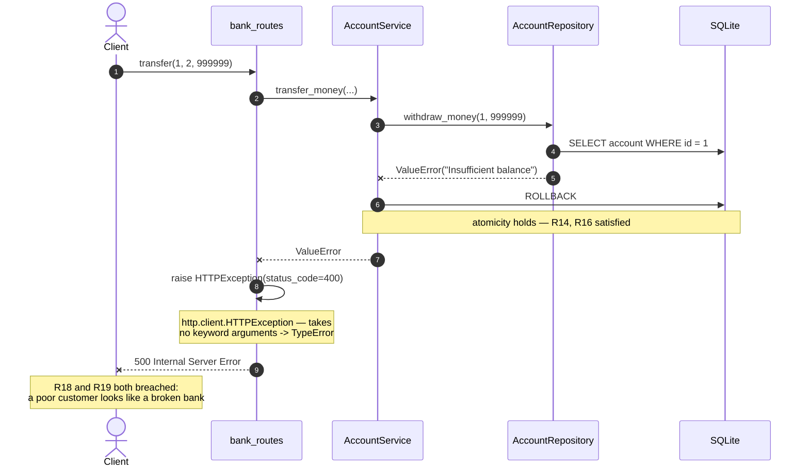
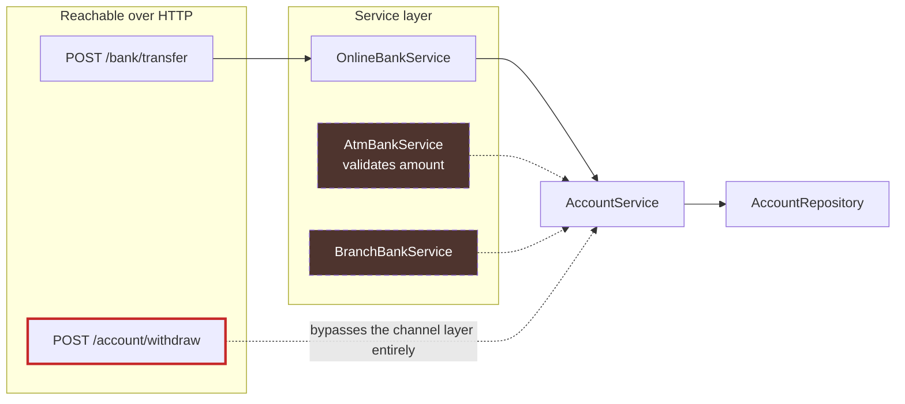
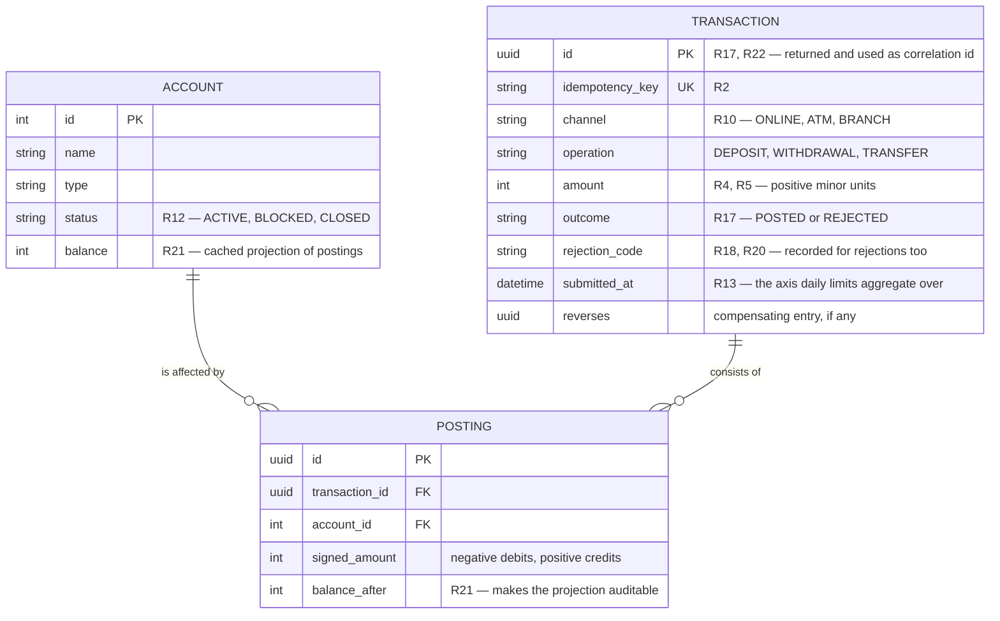

# HB-10: Transaction Process Rules — Happy Bank

**Example solution** for [task.md](task.md).

| | |
|---|---|
| **Revision analysed** | commit **Add task HB-10** |
| **Scope** | rules governing the submission of a money-moving transaction |
| **Method** | rules defined first from the domain, then confronted with `app/` — every claim about the code was executed, not read |
| **Verdict** | 6 of 22 rules implemented, 3 partial, 13 absent. **4 confirmed defects, 2 of them allow money to be created or stolen.** |

---

## 1. Scope and vocabulary

"Submitting a transaction" is the act of a **channel** asking the bank to move a
definite **amount** between a **debit party** and a **credit party**. It is not the
same as the money moving — submission is a request that the bank either *posts* or
*rejects*, and the rules below govern which of the two happens.

| Term | Meaning in this document |
|---|---|
| **Submission** | one inbound request to move money; the unit the rules apply to |
| **Operation** | `DEPOSIT`, `WITHDRAWAL` or `TRANSFER` |
| **Channel** | where the submission came from: `ONLINE`, `ATM`, `BRANCH` |
| **Debit party** | the account money leaves; absent for `DEPOSIT` |
| **Credit party** | the account money enters; absent for `WITHDRAWAL` |
| **Posting** | the balance change itself — the effect of an accepted submission |
| **Terminal outcome** | `POSTED` or `REJECTED`; every submission reaches exactly one |

Everything below is stated for a single-currency bank holding integer minor units,
which is what the `Account` model (`app/models/account.py:4-9`) describes today.

---

## 2. The submission process

A submission passes through six gates in a fixed order. The order matters: cheap and
context-free checks run before expensive ones, and **authorization runs before any
rule that could leak whether an account exists or how much it holds**.



Gates 0–4 are **pure decisions** — they change nothing. Only Gate 5 changes state.
That split is what makes the process testable: every rejection can be exercised
without touching the database.

---

## 3. The rules

### 3.1 Intake

| # | Rule | Rationale |
|---|---|---|
| **R1** | A submission names exactly one operation, one channel, an amount, and the parties that operation requires — a `TRANSFER` names both, a `WITHDRAWAL` only the debit party, a `DEPOSIT` only the credit party. | An underspecified submission cannot be audited afterwards. |
| **R2** | Every submission carries a caller-generated **idempotency key**. A repeat of a key already seen returns the first outcome verbatim and moves no money. | Retries after a timeout are normal; double-posting is not. |
| **R3** | Money-moving parameters travel in the request **body**, never in the URL. | Query strings land in access logs, browser history and proxies. |

### 3.2 Structural validation

| # | Rule | Rationale |
|---|---|---|
| **R4** | `amount > 0` strictly. Zero and negative amounts are rejected. | A negative amount silently inverts the direction of the money — see [§6.1](#61-d-1--negative-amounts-create-money-and-drain-third-party-accounts). |
| **R5** | The amount is an integer number of minor units. No floating point anywhere in the path. | Binary floats cannot represent money exactly. |
| **R6** | The amount does not exceed the **per-channel maximum**. Cash channels: 10 000. Online: a limit chosen by the Product Owner — the absence of one is a decision, not a default. | Caps bound the damage of a compromised credential. |
| **R7** | For a `TRANSFER`, debit party ≠ credit party. | A self-transfer is always a no-op; accepting it hides a caller bug. |

### 3.3 Authorization

| # | Rule | Rationale |
|---|---|---|
| **R9** | The submitter is authenticated and authorized on the **debit** party. Crediting needs no permission from the credit party; debiting always does. | Without this the account id *is* the credential. |
| **R10** | The channel is permitted to perform the operation — per the matrix in [§5](#5-channel--operation-matrix). | A channel that can do everything makes per-channel limits meaningless. |

### 3.4 Existence and account state

| # | Rule | Rationale |
|---|---|---|
| **R8** | Every party named must exist. A missing account is a **distinct** outcome from a rule rejection, not a variation of it. | The caller's repair action differs: fix the id vs. fix the amount. |
| **R12** | Both accounts are in a state that permits their side of the posting — active, not closed, not blocked. | Requires an account status the model does not yet have. |

### 3.5 Funds and limits

| # | Rule | Rationale |
|---|---|---|
| **R11** | After posting, the debit account's balance is `>= 0`. No implicit overdraft. The check happens **inside** the same database transaction as the posting, against the same locked row. | Checked outside the transaction, it is a race, not a rule. |
| **R13** | Cumulative per-account, per-channel, per-day limits hold after the posting. | Single-transaction caps alone are trivially circumvented by splitting. |

### 3.6 Execution

| # | Rule | Rationale |
|---|---|---|
| **R14** | The debit and the credit post **atomically** — both or neither. | The defining property of a transfer. |
| **R15** | The read-modify-write of a balance is serialized per account, by locking the row or by a conditional update. | Two concurrent transfers that both read the old balance lose one update. |
| **R16** | A failed posting leaves no partial balance change and no ledger entry other than the rejection record. | Partial state is unrecoverable without a ledger. |

### 3.7 Outcome and audit

| # | Rule | Rationale |
|---|---|---|
| **R17** | Exactly one terminal outcome per submission, returned to the caller. | "Successful" with no id is not an outcome a caller can reconcile against. |
| **R18** | Rejections are **typed** and each type maps to one status and one machine-readable code: `VALIDATION` → 422, `ACCOUNT_NOT_FOUND` → 404, `NOT_AUTHORIZED` → 403, `INSUFFICIENT_FUNDS` → 409, `LIMIT_EXCEEDED` → 409, `TRANSIENT` → 503. | An opaque 400 forces callers to parse prose or guess. |
| **R19** | A breach of a business rule is **never** a 5xx. 5xx means the bank malfunctioned. | Monitoring cannot distinguish a broken bank from a poor customer otherwise. |
| **R20** | Every submission — posted **and** rejected — is recorded immutably: id, timestamp, channel, operation, parties, amount, outcome, reason. | Rejections are the interesting half of a fraud investigation. |
| **R21** | Balance is derivable from the ledger. The `balance` column is a cached projection of it, not the source of truth. | Without this, a wrong balance can never be proven wrong. |
| **R22** | Every log line emitted during a submission carries the transaction id as a correlation id. | Otherwise concurrent submissions interleave unreadably in the log. |

### 3.8 Lifecycle



The one rule the diagram encodes rather than states: **`Posted` has no outgoing
edge.** There is no cancel, no edit, no delete. Reversal is a new submission in the
opposite direction that references the original.

---

## 4. How the process maps onto the current architecture

Happy path, as the code is wired today:



The rejection path is where the implementation departs from the rules most visibly:



---

## 5. Channel × operation matrix

R10 needs an explicit matrix. This is what the *service layer* declares — and, in
the second column of each cell, what is actually reachable over HTTP:

| Channel | `DEPOSIT` | `WITHDRAWAL` | `TRANSFER` | Amount validation |
|---|---|---|---|---|
| **ONLINE** (`OnlineBankService`) | not offered | not offered | declared **and reachable** | **none** |
| **ATM** (`AtmBankService`) | declared, unreachable | declared, unreachable | not offered | max 10 000 (`validate_maximum_cash_amount`) |
| **BRANCH** (`BranchBankService`) | declared, unreachable | declared, unreachable | declared, unreachable | **none** |
| *(no channel)* | — | **reachable** via `POST /account/withdraw` | — | **none** |



Two things fall out of the picture:

1. **The only channel with amount validation is the only channel nobody can reach.**
   `AtmBankService` is the sole caller of `AmountValidator`, and no dependency in
   `app/api/dependencies.py` constructs it. R6 is implemented and dead.
2. **`POST /account/withdraw` calls `AccountService` directly**
   (`app/api/account_routes.py:25`), skipping the channel layer. Whatever rules the
   channel layer grows later, that route will not have them.

---

## 6. Confirmed defects

Each was reproduced against this revision; commands in [Appendix A](#appendix-a--reproduction).

### 6.1 D-1 — Negative amounts create money and drain third-party accounts

**Rules breached: R4.** No layer checks the sign of the amount, and the guard in
`AccountRepository.withdraw_money` (`app/repository/account_repository.py:42`) is
`account.balance < amount`, which a negative amount passes trivially.

```
POST /account/withdraw?account_id=1&amount=-100   -> 200   Alice 1000 -> 1100
POST /bank/transfer?from=1&to=2&amount=-300       -> 200   Alice 1100 -> 1400, Bob 1000 -> 700
```

A negative transfer is a **pull**: it debits the account the caller nominated as the
recipient, and the insufficient-funds check never runs against it. Anyone who can
call the endpoint can empty any account by transferring a negative amount *to* it.

**Severity: critical.** Both money creation and unauthorized debit, from an
unauthenticated endpoint.

### 6.2 D-2 — Business-rule rejections return 500

**Rules breached: R18, R19.** `app/api/bank_routes.py:1` imports `HTTPException`
from `http.client` instead of `fastapi`. That class takes no keyword arguments, so
`raise HTTPException(status_code=400)` raises `TypeError` inside the exception
handler and the client receives a 500.

```
POST /bank/transfer?from=1&to=2&amount=999999     -> 500 Internal Server Error
```

`app/api/account_routes.py:3` imports the same name correctly, so the withdrawal
route returns 400 — the two routes disagree about what a rule breach looks like.
Neither returns a reason: `HTTPException(status_code=400)` carries no `detail`, so
"insufficient balance" and "account not found" are indistinguishable to the caller.

### 6.3 D-3 — Multi-error validation results raise `TypeError`

**Rules breached: R17.** `ValidationResult.join` (`app/validator/amount_validator.py:33`)
collects `result.error_messages` — a *list* — into `error_messages`, producing a list
of lists. `raise_if_error` then calls `", ".join(...)` on it:

```
ValidationResult.join([error('a'), error('b')]).raise_if_error()
-> TypeError: sequence item 0: expected str instance, list found
```

Latent today because only one validator exists. It detonates the moment a second is
added — which R6 and R13 both require. Fix is `extend` instead of `append` semantics.

### 6.4 D-4 — Self-transfer accepted

**Rules breached: R7.** `transfer_money(1, 1, 100)` returns 200. The debit and the
credit hit the same row inside one transaction and cancel out, so no money is lost —
but the bank reports a successful transfer that did nothing, and with R20 in place it
would write a meaningless ledger entry pair.

---

## 7. Rule-by-rule comparison with the code

| # | Rule | Status | Evidence |
|---|---|---|---|
| R1 | Complete submission | 🟡 partial | Parties and amount required by signature; channel and operation implied by the route, never recorded |
| R2 | Idempotency key | 🔴 absent | No key anywhere; a retried POST posts twice |
| R3 | Parameters in body | 🔴 absent | Query parameters (`bank_routes.py:12`), so amounts and account ids land in access logs |
| R4 | `amount > 0` | 🔴 absent | **D-1** |
| R5 | Integer minor units | 🟢 done | `amount: int` throughout; FastAPI rejects non-integers at the boundary |
| R6 | Per-channel maximum | 🟡 partial | `validate_maximum_cash_amount` exists (max 10 000) but only `AtmBankService` calls it, and that service is unreachable |
| R7 | Debit ≠ credit | 🔴 absent | **D-4** |
| R8 | Parties exist | 🟡 partial | Detected (`account_repository.py:41,58`) but surfaced as a generic 400/500, not as a distinct outcome |
| R9 | Authorization | 🔴 absent | No authentication in the application at all; any caller may debit any account |
| R10 | Channel permitted | 🔴 absent | Channel abstraction exists but is bypassed by `/account/withdraw` and unenforced |
| R11 | No overdraft | 🟢 done | `account_repository.py:42-43`, inside the transaction opened at `account_service.py:31` |
| R12 | Account state | 🔴 absent | `Account` has no status field |
| R13 | Daily limits | 🔴 absent | Not expressible — no transaction history exists to aggregate |
| R14 | Atomic posting | 🟢 done | `with self.account_repository.session.begin()` — verified: a transfer to a missing account leaves both balances untouched |
| R15 | Serialized per account | 🔴 absent | Plain `SELECT` then in-Python arithmetic; no `FOR UPDATE`, no conditional update. Survives today only because SQLite serializes writers |
| R16 | No partial effect | 🟢 done | Follows from R14; verified by the rollback probe |
| R17 | One terminal outcome | 🟡 partial | Returns a message but no transaction id and nothing to reconcile against |
| R18 | Typed rejections | 🔴 absent | **D-2** — one untyped, detail-less 400 on one route, 500 on the other |
| R19 | Rule breach ≠ 5xx | 🔴 absent | **D-2** |
| R20 | Immutable record | 🔴 absent | No `Transaction` entity. `AccountService` logs the intent (`account_service.py:29,34`) but logs rotate and are git-ignored — that is telemetry, not an audit trail |
| R21 | Balance from ledger | 🔴 absent | `Account.balance` is the sole record; a wrong balance is unfalsifiable |
| R22 | Correlation id | 🔴 absent | Log lines carry no request or transaction identifier |

**6 implemented, 3 partial, 13 absent.**

The shape of the result is worth naming: **the mechanical core is sound and the
policy layer is missing.** Atomicity, rollback and the overdraft check — the parts
that are hardest to retrofit — are correct. What is absent is everything that
decides *whether* a submission should have been accepted, plus any record that it
was.

---

## 8. The missing entity

Eight of the thirteen absent rules (R2, R13, R17, R20, R21, R22, and workable forms
of R12 and R15) are blocked on the same gap: **there is no transaction record.**
Adding validators does not unblock them. This does:



`POSTING` is what makes a transfer one transaction with two effects rather than two
unrelated balance edits, and `balance_after` is what turns R21 from an assertion into
something a reconciliation job can verify row by row.

---

## 9. Recommended order of work

Ordered by damage prevented per unit of effort, not by rule number.

| Priority | Change | Rules | Effort |
|---|---|---|---|
| **P0** | Reject `amount <= 0` at the API boundary — `Annotated[int, Field(gt=0)]` — **and** in `AccountRepository`, so no future caller can bypass it | R4 | trivial |
| **P0** | Fix the import in `bank_routes.py:1` to `from fastapi import HTTPException`; add a `detail` | R18, R19 | trivial |
| **P1** | Typed exceptions (`InsufficientFunds`, `AccountNotFound`, …) with one exception handler mapping them to the statuses in R18 | R8, R17, R18 | small |
| **P1** | Reject self-transfer; fix `ValidationResult.join`; move parameters into a request body | R7, R3, D-3 | small |
| **P1** | Wire `AtmBankService` and `BranchBankService` into `dependencies.py`, or delete them — an unreachable validator is worse than no validator, because it reads as coverage | R6, R10 | small |
| **P2** | Introduce `TRANSACTION` + `POSTING`; write both on every submission including rejections; return the id | R17, R20, R21, R22 | medium |
| **P2** | Idempotency key, unique-constrained, checked before Gate 1 | R2 | medium |
| **P3** | Authentication and ownership check on the debit party | R9, R10 | medium |
| **P3** | `Account.status`; per-account row locking or conditional update on posting | R12, R15 | medium |
| **P3** | Daily limits aggregated over `TRANSACTION.submitted_at` | R13 | medium |

P0 is two one-line edits and closes the two defects that let an anonymous caller
create money and empty someone else's account.

---

## Appendix A — Reproduction

Balances start at 1000 / 1000 (`resources/data/default_accounts.sql`).

**Defects D-1, D-2, D-4** — against a running server or a `TestClient`:

```python
from fastapi.testclient import TestClient
from app.main import app

c = TestClient(app, raise_server_exceptions=False)
c.post("/api/v1/bank/transfer?from_account_id=1&to_account_id=2&amount=999999")  # 500  <- D-2
c.post("/api/v1/bank/transfer?from_account_id=1&to_account_id=2&amount=-100")    # 200  <- D-1
c.post("/api/v1/bank/transfer?from_account_id=1&to_account_id=1&amount=10")      # 200  <- D-4
c.post("/api/v1/account/withdraw?account_id=1&amount=-100")                      # 200  <- D-1
c.get("/api/v1/account/1").json()   # balance 1200 after starting at 1000
```

**D-3:**

```python
from app.validator.amount_validator import ValidationResult as R
R.join([R.error('a'), R.error('b')]).raise_if_error()
# TypeError: sequence item 0: expected str instance, list found
```

**R14 / R16 hold** — a transfer to a non-existent account rolls the debit back:

```python
from app.services.account_service import AccountService
svc.transfer_money(1, 999, 100)   # ValueError("Account not found"); both balances unchanged
```

Run with `PYTHONPATH=. .venv/bin/python`. Note that these probes write to the
development `app.db`; reset it with
`UPDATE account SET balance = 1000;` or by deleting the file — `create_default_accounts()`
recreates it at startup.
